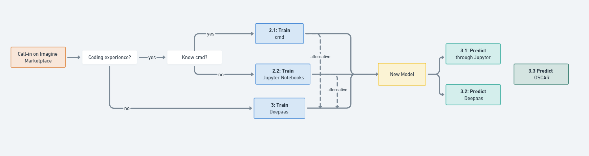

# Call-in Marketplace
[](https://jenkins.services.ai4os.eu/job/AI4OS-hub/job/phyto-plankton-classification/job/main/)

**Flowchart:** The flow inside the module




Call-in on Imagine Marketplace and follow the [Tutorial](https://docs.ai4os.eu/en/latest/user/howto/train/dashboard.html).  
Important to remember here: if you have coding experience through the flowchart, use 'Jupyter', if not, use 'Deepaas' when you fill in the general information.


**General configuration:**
- Deployment title: give name
- Deployment description: add description
- service to run: Jupyter, give pw
- docker tag: CPU (can also use GPU or latest)

 - how do users know what to do, deepaas or jupyter? → jupyter for now, docker tag CPU

deepaas: Only activates the API to run the module, can be convenient if user has zero experience with coding and has all their data on nextcloud already
Jupyter: accesses jupyter notebook from which deepaas can be ran with this command: nohup deep-start --deepaas &


**Hardware configuration:**

- Number of CPU: 1 for inference or 4/8 for training (max 10)  
- Number of GPU: 0 (or 1 for training while combining the docker GPU tag) – not many available  
- GPU model: all options are good  
- RAM: 8000 MB default (max 40 GB)  
- Disk memory: 10000 MB default (max 50 GB)


**Data configuration**
***advanced settings***
- storage: /srv/.rclone/rclone.conf
- Rclone vendor: nextcloud
- storage URL: https://share.services.ai4os.eu/remote.php/webdav/
- RCLONE user and password:
  - log in to  https://share.services.ai4os.eu/index.php/login?redirect_url=/index.php/apps/dashboard/ using EGI and use your institutes IDP if possible
  - in account go to profile > security > devices and sessions

***Dataset configurations***
Pull in in data from zenodo/doi.

**User Group error**
- https://aai.egi.eu/registry/co_petitions/start/coef:550 
- https://aai.egi.eu/registry/co_petitions/start/coef:546

# 1. Train the phyto-plankton-classifier

You can train your own audio classifier with your custom dataset. For that you have to:

## 1. Data preprocessing

The first step to train you image classifier if to have the data correctly set up. 

### 1.1 Prepare the images

The model needs to be able to access the images. Please use a standard image format (like `.png` or `.jpg`). 

So you either have to place your images in the [./data/images](https://github.com/ai4os-hub/phyto-plankton-classification/tree/main/data/images) folder or if you have your data somewhere else you can use that location by setting the `image_dir` parameter in the training args, for example, if you're data is on nextcloud, please change the parameter to: `storage/name_folder/images`. 

Another way is to copy the images 
```bash
rclone copy rshare:/data/dataset_files /srv/phyto-plankton-classification/data/dataset_files
rclone copy rshare:/data/images /srv/phyto-plankton-classification/data/images
```

### 1.2 Prepare the data splits (optional)

Next, you need add to the [./data/dataset_files](https://github.com/ai4os-hub/phyto-plankton-classification/tree/main/data/dataset_files) directory the following files:

| *Mandatory files* | *Optional files*  | 
|:-----------------------:|:---------------------:|
|  `classes.txt`, `train.txt` |  `val.txt`, `test.txt`, `info.txt`,`aphia_ids.txt`|

The `train.txt`, `val.txt` and `test.txt` files associate an image name (or relative path) to a label number (that has
to *start at zero*).
The `classes.txt` file translates those label numbers to label names.
The `aphia_ids.txt` file translates those the classes to their corresponding aphia_ids.
Finally the `info.txt` allows you to provide information (like number of images in the database) about each class. 

You can find examples of these files at [./data/demo-dataset_files](https://github.com/ai4os-hub/phyto-plankton-classification/tree/main/data/demo-dataset_files). 


If you don't want to create your own datasplit, this will be done automatically for you with a 80% train, 10% validation, and 10% test split.


## 2. Training methods

### 2.1: Train with cmd

#### 2.1.1: Adapting the yaml file
Clarify the location of the images inside the [yaml file](https://github.com/ai4os-hub/phyto-plankton-classification/tree/main/etc/config.yaml) file. If not, [./data/images](https://github.com/ai4os-hub/phyto-plankton-classification/tree/main/data/images) will be taken. 
Any additional parameter can also be changed here such as the type of split for training/validation/testing, batch size, etc

You can change the config file directly as shown below, or you can change it when running the api.

```bash
  images_directory:
    value: "/srv/phyto-plankton-classification/data/images"
    type: "str"
    help: >
          Base directory for images. If the path is relative, it will be appended to the package path.
```
#### 2.1.2: Running the training (Method Jupyter)
After this, you can go to `/srv/phyto-plankton-classification/planktonclas#` and run `train_runfile.py`.

```bash
cd /srv/phyto-plankton-classification/planktonclas` 
python train_runfile.py
```
The new model will be saved under [phyto-plankton-classification/models](https://github.com/ai4os-hub/phyto-plankton-classification/tree/main/models)

#### Alternative:  Running the training (method Deeepaas)
In stead of running everything within Jupyter, you can also run the following command: 
```bash
nohup deep-start --deepaas &
```
Now you can go back to the deployments and run the API and change the paramters there. It is the same as method 2.3 for training, but more costumized. 

### 2.2: Train with Jupyter Notebooks (Recommended)
#### 2.2.1: Adapting the yaml file
Similar to [2.1.2: Running the training](#2.1.2:_Running_the_training),clarify the location of the images inside the [yaml file](https://github.com/ai4os-hub/phyto-plankton-classification/tree/main/etc/config.yaml) file. If not, [./data/images](https://github.com/ai4os-hub/phyto-plankton-classification/tree/main/data/images) will be taken. 
Any additional parameter can also be changed here such as the type of split for training/validation/testing, batch size, etc

You can change the config file directly as shown below.

```bash
  images_directory:
    value: "/srv/phyto-plankton-classification/data/images"
    type: "str"
    help: >
          Base directory for images. If the path is relative, it will be appended to the package path.
```
#### 2.2.2: Go to Notebooks (Method Notebooks)

You can have more info on how to interact directly with the module (not through the DEEPaaS API) by examining the 
``./notebooks`` folder:

* [dataset exploration notebook](https://github.com/ai4os-hub/phyto-plankton-classification/tree/main/notebooks/1.0-Dataset_exploration.ipynb):
  Visualize relevant statistics that will help you to modify the training args.
* [Image transformation notebook](https://github.com/ai4os-hub/phyto-plankton-classification/tree/main/notebooks/1.1-Image_transformation.ipynb):
  To conform a new dataset with the training set that was used
* [Image transformation notebook](https://github.com/ai4os-hub/phyto-plankton-classification/tree/main/notebooks/1.2-Image_augmentation):
  Notebook to perform image augmentation and expand the dataset.
* [Model training notebook](https://github.com/ai4os-hub/phyto-plankton-classification/tree/main/notebooks/2.0-Model_training):
  Notebook to perform image augmentation and expand the dataset.
* [computing predictions notebook](https://github.com/ai4os-hub/phyto-plankton-classification/tree/main/notebooks/3.0-Computing_predictions.ipynb):
  Test the classifier on a number of tasks: predict a single local image (or url), predict multiple images (or urls),
  merge the predictions of a multi-image single observation, etc.
* [predictions statistics notebook](https://github.com/ai4os-hub/phyto-plankton-classification/tree/main/notebooks/3.1-Prediction_statistics.ipynb):
  Make and store the predictions of the `test.txt` file (if you provided one). Once you have done that you can visualize
  the statistics of the predictions like popular metrics (accuracy, recall, precision, f1-score), the confusion matrix, etc.

#### Alternative:  Running the training (method Deeepaas)
In stead of running everything within the notebooks, you can also run the following command: 
```bash
nohup deep-start --deepaas &
```

Now you can go back to the deployments and run the API and change the paramters there. It is the same as method 2.3 for training, but more costumized. 

## 2.3: Train with Deepaas
### activation of the API
Open deepaas through the API link in your deployment. 
Look for the methods belonging to the `planktonclas` module.
Look for the ``TRAIN`` POST method. Click on 'Try it out', change whatever training args
you want and click 'Execute'. The training will be launched and you will be able to follow its status by executing the 
``TRAIN`` GET method which will also give a history of all trainings previously executed.

You can follow the training monitoring (Tensorboard) by going back to the deployment page and selecting: monitor


# Predict the phyto-plankton-classifier
## 3. Predicting methods
### 3.1: Train with Jupyter Notebooks (Recommended)
Select the image or images you wanne predict.

You can have more info on how to interact directly with the module (not through the DEEPaaS API) by examining the 
``./notebooks`` folder:

* [computing predictions notebook](./notebooks/3.0-Computing_predictions.ipynb):
  Test the classifier on a number of tasks: predict a single local image (or url), predict multiple images (or urls),
  merge the predictions of a multi-image single observation, etc.
* [predictions statistics notebook](./notebooks/3.1-Prediction_statistics.ipynb):
  Make and store the predictions of the `test.txt` file (if you provided one). Once you have done that you can visualize
  the statistics of the predictions like popular metrics (accuracy, recall, precision, f1-score), the confusion matrix, etc.


## 3.2: Predict with Deepaas
In stead of running everything within the notebooks, you can also run the following command: 
```bash
nohup deep-start --deepaas &
```
Now you can go back to the deployments and run the API and change the parameters there when you look for the `PREDICT` POST method. Click on 'Try it out', change whatever test args
you want and click 'Execute'. You can **either** supply a:

* a `image` argument with a path pointing to an image.

* a `zip` argument with an URL pointing to zipped folder with images.


## 3.3: Predict with OSCAR 

Oscar has two options, either you can work through the oscar website (user friendly) or you can use python scripts (coding experience.)
## 3.3.1: Predict through site 

You can follow the [Oscar Tutorial](https://docs.ai4eosc.eu/en/latest/howtos/deploy/oscar-manual.html). 
But basically go to: https://inference.cloud.ai4eosc.eu/ui/#/login or https://inference-walton.cloud.imagine-ai.eu/ui/#/login and sign in and look for the 'phyto-plankton-classifier'. You can put upload images in the phytoplankton-classifier bucket under "input" and found the results under "output".

If  you don't have an account yet then:

1) go to https://aai.egi.eu/ and login via the account you used for the
platform (usually your institute)

2) go to top-right corner, you should see your name. Click on it and
select "My EGI User Community Identity"

3) on the opened page, scroll down to "Role Attributes" and check if
you find in the table a row with "vo.imagine-ai.eu". The "Status" must
be "Active", also "Valid Through" should be in future.

4) IF you DON'T see "vo.imagine-ai.eu" listed, please, apply for the
membership by clicking:
https://aai.egi.eu/registry/co_petitions/start/coef:546

## 3.3.1: Predict through python scripts
You can follow the [Oscar Tutorial](https://docs.ai4eosc.eu/en/latest/howtos/deploy/oscar.html). 

Some example scripts can be found here [oscar](../oscar/).
